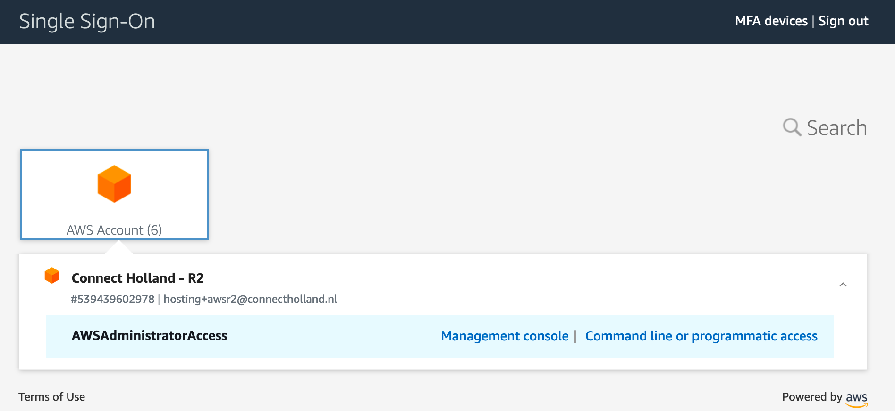
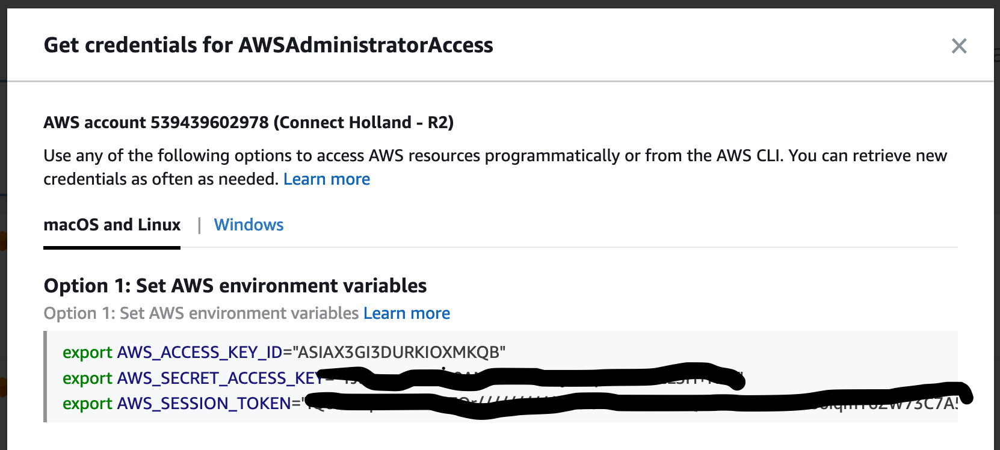

# Prerequisites
To participate in the AWS serverless tutorial the following prerequisites are expected to have been completed.

## AWS account
You'll need an account to gain access to AWS. You'll need both console and programmatic access. The procedures depend on which kind of account you're using.

### IAM account
If you have a IAM user account programmatic access consists of 2 values which you'll need when using the cli (see below).
* AWS_ACCESS_KEY_ID
* AWS_SECRET_ACCESS_KEY

You can find these variables in the console after logging in IAM > Users > <your user> > Security credentials.

### SSO
If you have an AWS single sign on account you can reach the console for the relevant account (application) after logging in:
 

Obtain the programmatic access keys from there as well. 


## AWS cli
Make sure the [AWS cli](https://docs.aws.amazon.com/cli/latest/userguide/install-cliv2-mac.html) is installed on your system. 

```bash
curl "https://awscli.amazonaws.com/AWSCLIV2.pkg" -o "AWSCLIV2.pkg"
sudo installer -pkg AWSCLIV2.pkg -target /
```

If you have programmatic access credentials from an IAM user account it is convenient to store these using `aws configure` (or `aws configure --profile <profile-name>` if you have a configured default account already). You'll need to choose a preferred AWS region, please choose `eu-west-1`. These details are stored in `~/.aws/credentials` and `~/.aws/config`.

If you have programmatic access credentials from SSO it's a little different: these include a mandatory session_token which has a limited ttl. 


It is easiest to follow Option 1: copy (one-click) the credentials from the sign in page and past them in a `.env` file. Add `export AWS_DEFAULT_REGION=eu-west-1` to this file. Then run `source .env` in the terminal to set the relevant environment variables.

When using the cli, credentials from in environment variables will superseed those store using `aws configure`. 

## Terraform
Terraform does not need to be installed but works as a standalone executable. Get the relevant binary from the [downloads page](https://www.terraform.io/downloads.html) and put it somewhere in a known PATH location or add the directory containing the terraform binary to your system's PATH.

## Python
### Versions: Pyenv
Python versions are easily installed and managed using [pyenv](https://github.com/pyenv/pyenv). 

Install pyenv on your machine with: `brew install pyenv`. 

We will use python 3.8: install the correct python version using. `pyenv install 3.8.6`

### Package manager: Poetry
Python dependency management is done using [Poetry](https://python-poetry.org/). See [installation instructions](https://python-poetry.org/docs/) if poetry has not been installed on your system. 

Once installed, initiate a project using `poetry init`. Then create a virtual environment use `poetry env use ~/.pyenv/versions/3.8.6/bin/python3.8` or whichever version is installed on your system.

Add dependencies using `poetry add <package>` with the optional `--dev` flag for development requirements. Project information and requirements are stored in `pyproject.toml`, dependencies are managed using the `poetry.lock` file in the root project directory.

For an existing project: install all dependencies using `poetry install`. 

### Pycharm
The recommended IDE is JetBrains' [PyCharm](https://www.jetbrains.com/pycharm/) which has a free [community version](https://www.jetbrains.com/pycharm/download/#section=mac). Also checkout the poetry plugin for integration with your Poetry environment.
